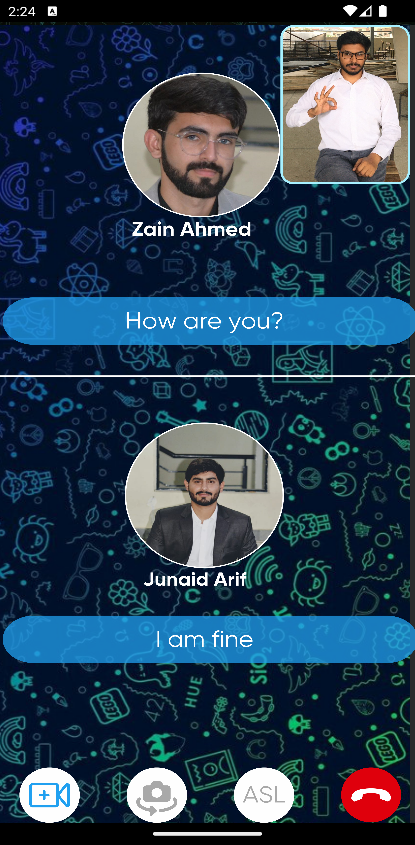

# CommFusion React Native

Welcome to CommFusion, a beautiful and inclusive real-time video calling application developed using React Native for the frontend.

## Introduction

CommFusion aims to provide seamless video calling experiences for everyone, fostering inclusivity and accessibility in communication. This README will guide you through getting started with the CommFusion frontend codebase and provide essential information for exploration and customization.

## Getting Started

To begin exploring or contributing to the CommFusion frontend, you can clone or download this repository to your local machine:

```bash
git clone https://github.com/your-username/CommFusion-React-Native.git

npx react-native run-android
```

Make sure you have the necessary tools and dependencies installed. For React Native development, you typically need Node.js, npm or yarn, and the React Native CLI. If you haven't set up your development environment yet, refer to the React Native documentation for detailed instructions.

## Screenshots

Here are some snapshots of the beautiful screens you'll encounter in CommFusion:

1. Splash Screen
   

2. Authentication Screen
   

3. Login Screen
   

4. Home Screen
   

5. Home FAB Screen
   

6. Call Logs Screen
   

7. Favorite Sign Screen
   

8. Beginner Level Screen
   

9. Alphabet Details Screen
   

10. Beginner Level Screen
    

11. Settings Screen
    

12. Notification Settings Screen
    

13. Profile Details Level Screen
    

14. Sign up Screen
    

15. Add New Contact Screen
    

16. Call Info Screen
    

17. Incoming Call Screen
    

18. OutGoing Call Screen
    

19. Video Call 1 Screen
    

20. Video Call 2 Screen
    

21. Video Call 3 Screen
    

22. Video Call 4 Screen
    

23. Video Call 5 Screen
    

24. Video Call 6 Screen
    

Feel free to explore the various screens and their functionalities within the app.

## Dependencies

Before diving into the codebase, make sure to install the required dependencies:

```bash
npm install
# or
yarn install
```

## Usage

Once dependencies are installed, you can run the app using the following command:

```bash
npx react-native run-android
# or
npx react-native run-ios
```

## Issues and Contributions

If you encounter any issues while using CommFusion or have suggestions for improvement, please don't hesitate to raise an issue or submit a pull request. Your contributions are highly valued and will help make CommFusion better for everyone.

## Credits

CommFusion React Native frontend is maintained by [MohammedUmerKhan](https://github.com/MohammedUmerKhan). Special thanks to all contributors who have helped make this project possible.

## Give it a Star

If you find CommFusion useful or appreciate the effort put into its development, consider giving it a star on GitHub to show your support.

Thank you for choosing CommFusion for your video calling needs. Happy communicating! 🚀
